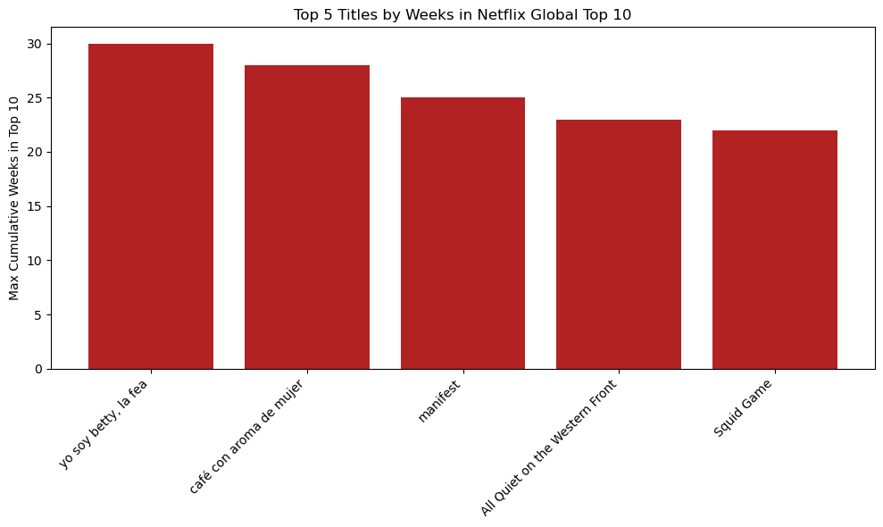
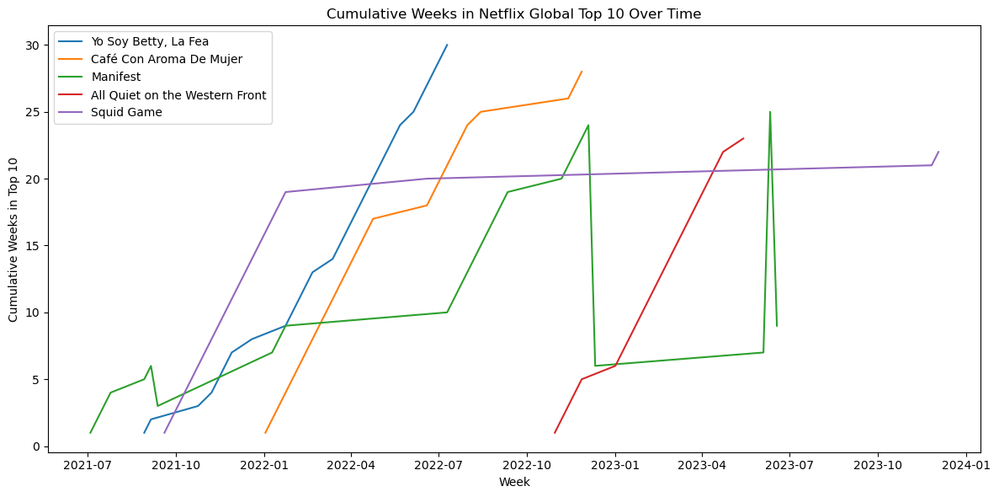

# Netflix Top 10 Longevity Analysis

Which titles stay in the Netflix global Top 10 the longest? This project uses Netflix's public Top 10 data to argue that weeks in the Top 10 is a better measure of a title's staying power than a strong debut.

## Key Findings

The five titles with the most cumulative weeks in the global Top 10:

| Title | Weeks in Top 10 | Countries Reached |
|---|---|---|
| Yo Soy Betty, La Fea | 30 | 16 |
| Café con Aroma de Mujer | 28 | 19 |
| Manifest | 25 | 93 |
| All Quiet on the Western Front | 23 | 91 |
| Squid Game | 22 | 94 |

- **Longevity and reach are different things.** The two longest-running titles charted in fewer than 20 countries, while Manifest, All Quiet on the Western Front, and Squid Game each reached more than 90.
- **Four of the five are TV series**, and three of the five are non-English titles.
- A big debut does not guarantee staying power, so weekly rank alone misses the titles that hold an audience over time.



## Data

[Netflix Top 10](https://www.netflix.com/tudum/top10) public lists, downloaded April 2024:

- **Most popular list:** 40 titles with hours viewed in their first 91 days
- **Global weekly list:** 5,840 weekly rankings
- **Country weekly list:** 272,260 weekly rankings by country

## Method

1. Checked each dataset for missing values and duplicates.
2. Converted week fields to dates and standardized the category labels to Film or TV.
3. Cleaned show titles so the three datasets could be joined.
4. Found each title's maximum cumulative weeks in the global Top 10 and selected the top five.
5. Joined in hours viewed and counted the distinct countries where each title charted.
6. Built charts on longevity, geographic reach, format, and Top 10 debut year.



## Recommendations

Written for a content strategy and acquisition audience:

- Invest in titles with proven longevity, especially international dramas.
- Track weeks in the Top 10 as a core success metric.
- Keep marketing behind strong titles beyond their first week.

## Limitations

- Hours viewed were available for only two of the top five titles, so viewership could not be compared across all five.
- The analysis covers only the top five titles, which is too few to generalize about formats or languages.

## How to Run

1. Download the three Excel files from the Netflix Top 10 site and save them in the same folder as the notebook, named `most-popular-netflix.xlsx`, `all-weeks-global-netflix.xlsx`, and `all-weeks-countries-netflix.xlsx`.
2. Install the required libraries:
```
   pip install pandas openpyxl matplotlib
```
3. Open `netflix_top10_longevity.ipynb` in Jupyter Notebook and run all cells.

## Files

- `netflix_top10_longevity.ipynb`: data cleaning, analysis, and charts
- `images/`: charts shown in this README

## Tools

Python, pandas, Matplotlib
